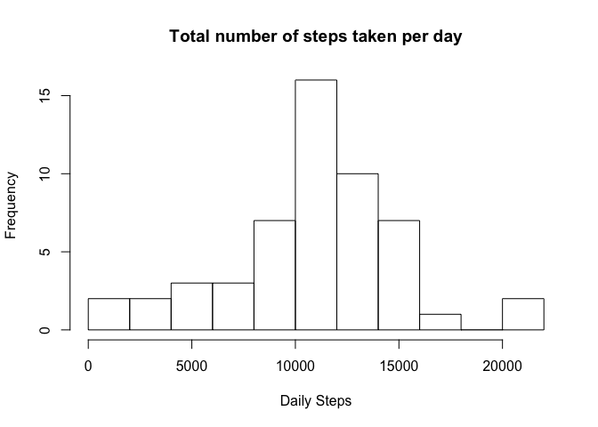
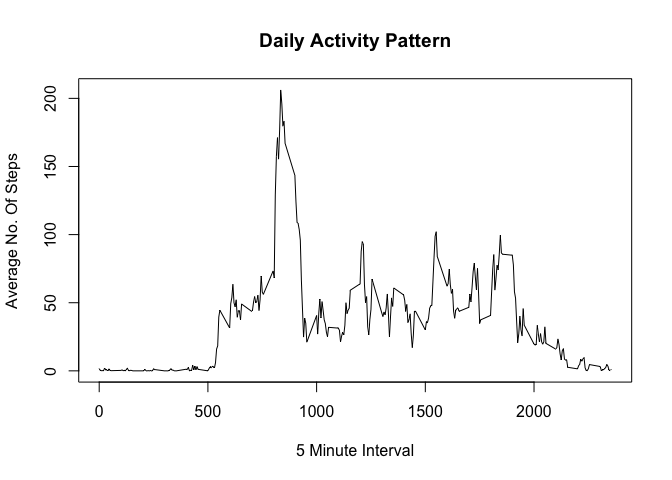
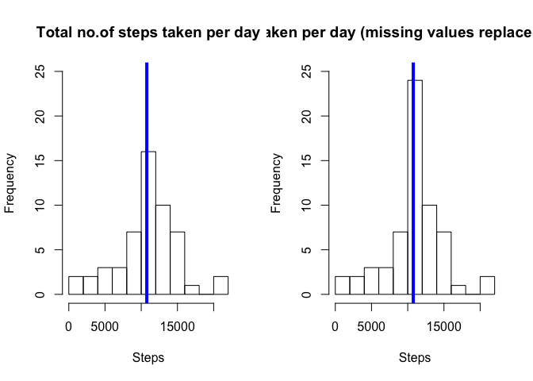
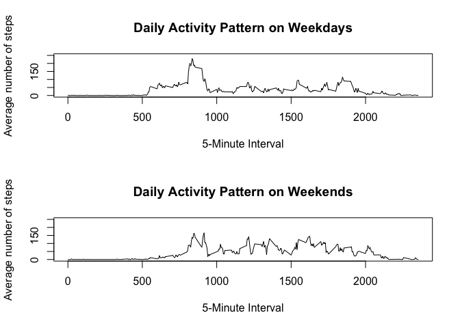

# PA1_template.Rmd
# Introduction : This assignment makes use of data from a personal activity monitoring device. This device collects data at 5 minute intervals through out the day. The data consists of two months of data from an anonymous individual collected during the months of October and November, 2012 and include the number of steps taken in 5 minute intervals each day. The variables included in this dataset are: 
## steps: Number of steps taking in a 5-minute interval (missing values are coded as 'NA')
## date: The date on which the measurement was taken in YYYY-MM-DD format
## interval: Identifier for the 5-minute interval in which measurement was taken
## The dataset is stored in a comma-separated-value (CSV) file and there are a total of 17,568 observations in this dataset.

# Pre-preparation of R code

```r
library(knitr)
opts_chunk$set(echo = TRUE, fig.show = 'hold')
```

# Libraries to be loaded :

```r
library(dplyr)
```

```
## 
## Attaching package: 'dplyr'
```

```
## The following objects are masked from 'package:stats':
## 
##     filter, lag
```

```
## The following objects are masked from 'package:base':
## 
##     intersect, setdiff, setequal, union
```

```r
library(lubridate)
library(ggplot2)
library(lattice)
```

## Load & Reading Activity.CSV file.
## Change the data into required data format

```r
setwd("~/Documents/ReproducibleResearchAssignment/RepData_PeerAssessment1")

filename <- unzip("activity.zip")

activitydata <- read.csv("activity.csv", colClass=c('integer', 'Date','integer'))

activitydata$date <- ymd(activitydata$date)
```
## Check the data using str() & head()


```r
str(activitydata)
```

```
## 'data.frame':	17568 obs. of  3 variables:
##  $ steps   : int  NA NA NA NA NA NA NA NA NA NA ...
##  $ date    : POSIXct, format: "2012-10-01" "2012-10-01" ...
##  $ interval: int  0 5 10 15 20 25 30 35 40 45 ...
```
## 'data.frame':	17568 obs. of  3 variables:
## steps   : int  NA NA NA NA NA NA NA NA NA NA ...
## date    : POSIXct, format: "2012-10-01" "2012-10-01" ...
## interval: int  0 5 10 15 20 25 30 35 40 45 ...


```r
head(activitydata)
```

```
##   steps       date interval
## 1    NA 2012-10-01        0
## 2    NA 2012-10-01        5
## 3    NA 2012-10-01       10
## 4    NA 2012-10-01       15
## 5    NA 2012-10-01       20
## 6    NA 2012-10-01       25
```
## steps    date       interval
## 1    NA 2012-10-01        0
## 2    NA 2012-10-01        5
## 3    NA 2012-10-01       10
## 4    NA 2012-10-01       15
## 5    NA 2012-10-01       20
## 6    NA 2012-10-01       25

# What is mean total number of steps taken per day?
## For this part of the assignment the missing values can be ignored.
### 1. Calculate the total number of steps taken per day.
### 2. Make a histogram of the total number of steps taken each day.
### 3. Calculate and report the mean and median of the total number of steps taken per day.

## Methodology and Result
### check missing values count

```r
sum(is.na(activitydata$steps))
```

```
## [1] 2304
```
## [1] 2304

## What is mean total number of steps taken per day?
### For the first two questions we will need a file that does not contain missing values. We found 2304 missing values, that will be excluded temporarily from our analysis.The dataset called 'clean.activity' is created for this reason.

```r
clean.activity <-activitydata[which(!is.na(activitydata$steps)),]
```
### The number of steps taken is measured in timeslots, 5-minute intervals, so in order to compute the total number of steps taken for each day we will aggregate the data by day.


```r
dailySteps <-tapply(clean.activity$steps, clean.activity$date, sum)
```
### So, now the 'dailySteps dataset contains the total number of steps taken for each day of October and November (total 53 days). Next is to make a histogram of the total number of steps taken each day.


```r
hist(dailySteps,10, main = "Total number of steps taken per day", xlab = "Daily Steps")
```

<!-- -->

## The mean total number of steps during a whole day is 10766, while the median of the total steps is 10765.


```r
mean(dailySteps)
```

```
## [1] 10766.19
```
## [1] 10766.19

```r
median(dailySteps)
```

```
## [1] 10765
```
## [1] 10765

# What is the average daily activity pattern?
## Make a time series plot(i.e. type = "1") of the 5 minute interval(x-axis) and the average no. of steps taken, averaged across all days(y-axis)
## Which 5 minute interval, on average across all the days in the dataset, contains the maximum number of steps? 
## In order to explore our data throughout the day, we will need to aggregate the dataset by the intervals. A per interval array is created for this reason and a time series plot will also be created. The coding of the interval names is such, so that e.g. 500 should be considered as 5:00 and 1000 as 10:00, and so on. So, one can consider the x-axis as a full 24-hour-day starting from midnight.

```r
AvDailyPat <-tapply(clean.activity$steps, clean.activity$interval, mean) 

plot(y = AvDailyPat, x = names(AvDailyPat), type = "l", xlab = "5 Minute Interval", main = "Daily Activity Pattern", ylab = "Average No. Of Steps")
```

<!-- -->
## Interval with max. av. number of steps throughout the days is 835 with 206.2 steps

```r
AvDailyPat[AvDailyPat==max(AvDailyPat)]
```

```
##      835 
## 206.1698
```
## 835 
## 206.1698 

# Imputing missing values

## Note that there are a number of days/intervals where there are missing values (coded as NA). The presence of missing days may introduce bias into some calculations or summaries of the data.

## 1. Calculate and report the total number of missing values in the dataset (i.e. the total number of rows with NAs)

## 2. Devise a strategy for filling in all of the missing values in the dataset. The strategy does not need to be sophisticated. For example, you could use the mean/median for that day, or the mean for that 5-minute interval, etc.

## 3. Create a new dataset that is equal to the original dataset but with the missing data filled in.

## 4. Make a histogram of the total number of steps taken each day and Calculate and report the mean and median total number of steps taken per day. Do these values differ from the estimates from the first part of the assignment? What is the impact of imputing missing data on the estimates of the total daily number of steps?

## Check missing values


```r
sum(is.na(activitydata$steps))
```

```
## [1] 2304
```
## [1] 2304


```r
sum(is.na(activitydata))
```

```
## [1] 2304
```
## [1] 2304

## The count of missing values in column 'steps' is same as in the whole dataset. 2304 missing values is around 13.11% of the total dataset which may create bias. To rule out bias, missing values need to be replaced thereby recreating the data set.
## Create a new data base


```r
NewActData <- activitydata
NewActData[which(is.na(NewActData$steps)), 1] <- AvDailyPat[as.character(NewActData[which(is.na(NewActData$steps)),3])]
```
### > str(NewActData) # New Data
### 'data.frame':	17568 obs. of  3 variables:
###  steps   : num  1.717 0.3396 0.1321 0.1509 0.0755 ...
###  date    : POSIXct, format:  ...
###  interval: int  0 5 10 15 20 25 30 35 40 45 ...
### > str(activitydata) # Earlier Data
### 'data.frame':	17568 obs. of  3 variables:
###  steps   : int  NA NA NA NA NA NA NA NA NA NA ...
###  date    : POSIXct, format:  ...
###  interval: int  0 5 10 15 20 25 30 35 40 45 ...

## Make Histogram with original data set with missing values & second one with new data set having replaced missing value 


```r
dailySteps_new<-tapply(NewActData$steps, NewActData$date, sum)
par(mfrow=c(1,2))
hist(dailySteps,10, main = "Total no.of steps taken per day", xlab = "Steps", ylim =c(0, 25))
abline(v = median(dailySteps), col = 4, lwd = 4)
hist(dailySteps_new,10, main = "Total no. of steps taken per day (missing values replaced with mean of interval)", xlab = "Steps", ylim =c(0, 25))
abline(v = median(dailySteps_new), col = 4, lwd = 4)
```

<!-- -->
## We now calculate the median and the mean of the filled in dataset

```r
mean(dailySteps_new)
```

```
## [1] 10766.19
```
## [1] 10766.19

```r
median(dailySteps_new)
```

```
## [1] 10766.19
```
## [1] 10766.19

```r
mean(dailySteps_new)-mean(dailySteps)
```

```
## [1] 0
```
## [1] 0

```r
median(dailySteps_new)-median(dailySteps)
```

```
## [1] 1.188679
```
## [1] 1.188679

## The impact of imputing missing data is negligible. Difference in Median is of just One Step between the new data set & the original one.

# Are there differences in activity patterns between weekdays and weekends?
## For this part the weekdays() function may be of some help here. Use the dataset with the filled-in missing values for this part.

## 1.Create a new factor variable in the dataset with two levels- 'weekday'and 'weekend' indicating whether a given date is a weekday or weekend day.
## 2. Make a panel plot containing a time series plot (i.e. type = '1') of the 5-minute interval (x-axis) and the average number of steps taken, averaged across all weekday days or weekend days (y-axis).

## Creation of factor with two levels-weekday & weekend indicating whether a given date is a weekday or weekend day.


```r
NewActData$wd<-weekdays(NewActData$date)
NewActData$fwd<- as.factor(c("weekend", "weekday"))
NewActData[NewActData$wd == "Sunday" | NewActData$wd == "Saturday" ,5]<- factor("weekend")
NewActData[!(NewActData$wd == "Sunday" | NewActData$wd == "Saturday"),5 ]<- factor("weekday")
```
## Two aggregated arrays for the total number of steps taken per 5-minute time interval for weekdays and weekends is made and also, a graph in order to compare if there is a difference.

## Note that the plot has been created in the base system.

```r
NewActData_we <- subset(NewActData, fwd == "weekend") 
NewActData_wd <- subset(NewActData, fwd == "weekday") 
AvDailyPat_we<-tapply(NewActData_we$steps, NewActData_we$interval, mean)
AvDailyPat_wd<-tapply(NewActData_wd$steps, NewActData_wd$interval, mean)
par(mfrow=c(2,1))
plot(y = AvDailyPat_wd, x = names(AvDailyPat_wd), type = "l", xlab = "5-Minute Interval",main = "Daily Activity Pattern on Weekdays", ylab = "Average number of steps",ylim =c(0, 250))
plot(y = AvDailyPat_we, x = names(AvDailyPat_we), type = "l", xlab = "5-Minute Interval",main = "Daily Activity Pattern on Weekends", ylab = "Average number of steps",ylim =c(0, 250))
```

<!-- -->

## Weekend begins later than weekday and average activity level (esp. peak) is lower than the weekday.


     


